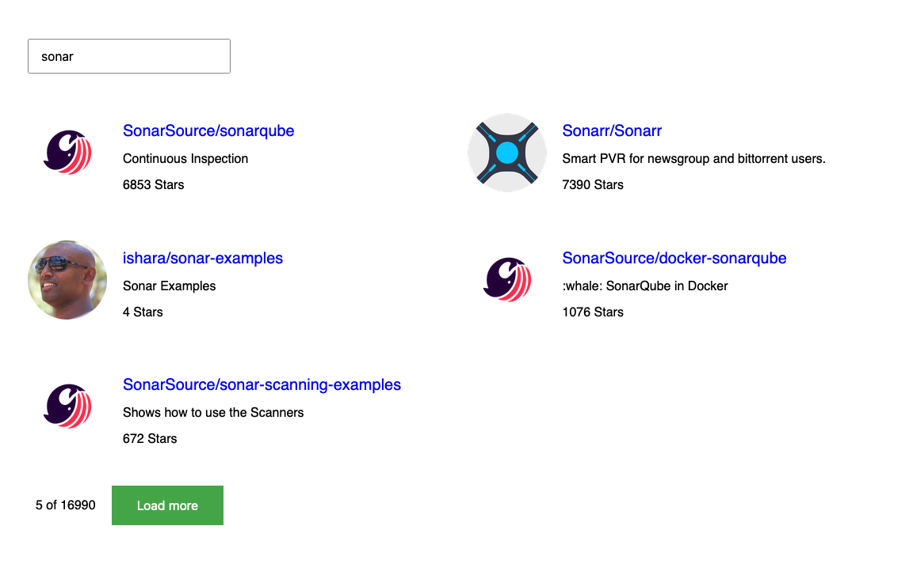

# GitHub Repo Fetcher

Hosted [here](https://xari.github.io/sonar-interview-react-app/), screenshot below.

This app demonstrates the following features that I find fun:

- Controlled state updates via `useReducer()`
- Paginated fetching of the data.
- Debounced event handlers with `lodash.debounce()`
